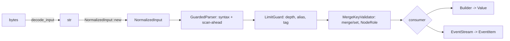

---
aliases:
  - Parse and Validate Plan
tags:
  - sdd
  - plan
  - parse
  - core
created: 2026-10-01
status: reverse-specified
related:
  - "[[spec]]"
  - "[[constitution]]"
---

# Technical Plan: Parse and validate YAML 1.2.2

> [!info] References
> **Spec**: [[spec]]. This plan describes the implementation that exists at v0.7.0 (HEAD dbe1f2b), reverse-specified from v0.6.6 and kept in sync through #637; it is the reference for changes, not a to-do list.

## 1. Architecture

### Approach

`saphyr-parser` 0.1.0 produces raw events; everything user-visible is built on top in `fast-yaml-core` so that parser upgrades never change the public API. Input is validated once (`NormalizedInput`), events pass through a chain of guards on the way to a single consumer (tree builder or public `EventStream`). Limits are enforced on the event stream before any tree is built, so hostile input is rejected while memory is still bounded.



### Key design decisions

| Decision | Choice | Rationale | Alternatives |
|----------|--------|-----------|--------------|
| Parser crate exposure | Hidden behind `Value` and `events::*` | Bindings and linter independent of saphyr | Re-export saphyr types |
| Typing | One `resolve_scalar` for loader and bindings | Cross-surface parity | Per-binding resolution |
| Input type | `NormalizedInput` is the only way to feed the parser; `clippy.toml` bans `saphyr_parser::Parser::new*` | Validation and BOM handling cannot be skipped | Validate at each call site |
| Limit enforcement point | Event stream, before building | Rejects amplification early | Post-build size check |
| Document limit | `ParseLimits.max_documents`, charged by `LimitGuard` on every `DocumentStart` through the shared `StreamBudget` counter (like alias bytes), so parallel chunks count per stream | One source of truth for every surface; the chunker pre-check reads the same field | A parallel-crate-only `Config` field (previous) |
| Scan-ahead | `Input` wrapper around the scanner | Scanner tokenizes a whole flow collection before its first event (about 190x amplification); events cannot see it | None viable |
| Builder | Iterative, heap stack; drop-safe depth | No stack overflow at depth 512 | Recursive |
| Merge validation | On events, shared by loader, formatter, bindings | Invalid `<<` hidden by a later duplicate key must still fail | Validate on the tree |
| Duplicate keys | Loader keeps first position, last value | PyYAML-compatible; linter reports them | Reject in core |
| Big integers | `BigInt` with canonical decimal text, 14 284-bit cap on radix literals | Exactness; CPython 4300-digit `int(str)` limit | f64 fallback |
| `Mapping`/`Set` | Insertion-ordered, order-insensitive `Eq`/`Hash`, per-process keyed entry hashes | YAML mapping equality is unordered | Order-sensitive |
| Key domains | `KeyDomain::{Yaml, StringKeys, Python}` | JSON/JS/Python hosts conflate keys YAML keeps distinct | Collapse silently |

## 2. Project structure

```
crates/fast-yaml-core/src/
├── parser.rs       Parser entry points, iterative Builder, strip_bom
├── input.rs        NormalizedInput (printable check, BOM, offset map, slicing)
├── encoding.rs     decode_input, UTF-16/32 detection
├── scan_guard.rs   GuardedInput / GuardedParser (scan-ahead)
├── limits.rs       Bounded<K>, ParseLimits, StreamBudget, LimitGuard (+ dump-side limits)
├── scalar.rs       resolve_scalar, BigIntRef
├── value.rs        Value, Float, BigInt, Mapping, Set
├── keys.rs         KeyDomain collision tables
├── merge.rs        merge_into, MergeTarget, NodeRole
├── merge_check.rs  MergeKeyValidator
├── events.rs       EventStream and public event types
├── options.rs      LoadOptions and policy enums
└── error.rs        ParseError, SyntaxError, SourcePosition
crates/fast-yaml-cli/src/commands/parse.rs   `fy parse`
```

## 3. Data model

```rust
pub enum Value { Null, Bool(bool), Int(i64), BigInt(BigInt), Float(Float),
                 String(String), Sequence(Vec<Value>), Mapping(Mapping), Set(Set) }

#[non_exhaustive]
pub enum ParseError {
    Syntax(SyntaxError),
    LimitExceeded { kind: LimitKind, at: SourcePosition, document: DocumentIndex },
    Merge { error: MergeError, at: SourcePosition, document: DocumentIndex },
    SetValue { at: SourcePosition, document: DocumentIndex },
    Key { error: KeyError, at: SourcePosition, document: DocumentIndex },
}
pub struct LoadOptions { pub keys: KeyDomain, pub duplicate_merge_keys: DuplicateMergeKeys, pub set_values: SetValues }
```

Invariants: `NormalizedInput` holds only c-printable characters and no prefix BOM; anchors reset per document; aliases are deep clones (so alias-cost accounting bounds real memory); every `ParseError` variant carries a `SourcePosition` (1-based line and column, raw `usize` fields until #638) and a 0-based `DocumentIndex`.

## 4. API design

Core entry points are listed in spec FR-040. CLI contract: `fy [GLOBAL] parse [--stats] [--max-depth N] [--max-alias-bytes B] [FILE]`; success prints `✓ YAML is valid`; errors print `error: Failed to parse YAML` plus the cause chain and, for limit errors, a `hint: raise with --max-...` line; exit codes 0/1/2.

## 5. Integration points

| Consumer | Uses |
|----------|------|
| `fast-yaml-linter` | `NormalizedInput`, `EventStream`, `parse_normalized_observed` |
| `fast-yaml-parallel` | `NormalizedInput::slice`, shared `StreamBudget`, `parse_normalized` |
| `fast-yaml-cli` | `parse_str_with_limits`, `decode_input` |
| Python / Node.js | `parse_all_with_options`, `resolve_scalar`, `merge_into` with their own mapping types |

## 6. Security

Input is untrusted. Defences: printable-character gate, event-stream limit guards, scan-ahead wrapper, iterative builder, `forbid(unsafe_code)`. Details in [[009-limits-security/spec|the limits spec]].

## 7. Testing strategy

| Level | What | Where |
|-------|------|-------|
| Unit | scalar grammar, BigInt canonical form, merge order, key domains, limits boundaries | `src/*.rs` test modules |
| Fixtures | 40 hand-written YAML 1.2 spec fixtures | `tests/yaml_spec_fixtures.rs`, `tests/fixtures/yaml-spec/` |
| Property | parse/emit round trip | `tests/roundtrip_proptest.rs`, `emit_roundtrip_proptest.rs` |
| Memory | scan-ahead amplification shapes | `tests/scan_memory.rs` |
| Conformance | official yaml-test-suite with xfail list | Python harness only (`python/tests/test_yaml_test_suite.py`) |
| Fuzz | parse, format, lint targets | `fuzz/fuzz_targets/` |
| CLI | exit codes and messages | `crates/fast-yaml-cli/tests/` |

## 8. Performance considerations

Parsing is single pass over events with a heap-stack builder; zero-copy slicing for parallel chunks. There is no parse benchmark in the repository, so README speed claims are for bindings and CLI only and are not reproducible from the repo.

## 9. Rollout plan

Not applicable (shipped). Breaking changes are allowed before 1.0 and are recorded in `CHANGELOG.md`.

## 10. Constitution compliance

| Principle | Status | Notes |
|-----------|--------|-------|
| Type safety | Compliant | Sealed `Bounded<K>` limits, `#[non_exhaustive]` policy enums, `NormalizedInput` |
| Limits | Partial | `MaxTagBytes` unvalidated; `max_documents` enforced in core |
| Surface parity | Compliant for typing; see spec section 8 for `fy parse` flag gaps | |

## 11. Risks and mitigations

| Risk | Impact | Prob. | Mitigation |
|------|--------|-------|------------|
| `saphyr-parser` upgrade changes messages or acceptance | med | med | yaml-test-suite xfail list; golden tests for common messages (missing) |
| Tab-after-colon limitation | low | high | Decision needed (spec open question 4) |
| No core-level conformance harness | med | low | Run Python harness in CI; consider a core harness |

## See also

- [[spec]]
- [[009-limits-security/spec|Limits and security]]
