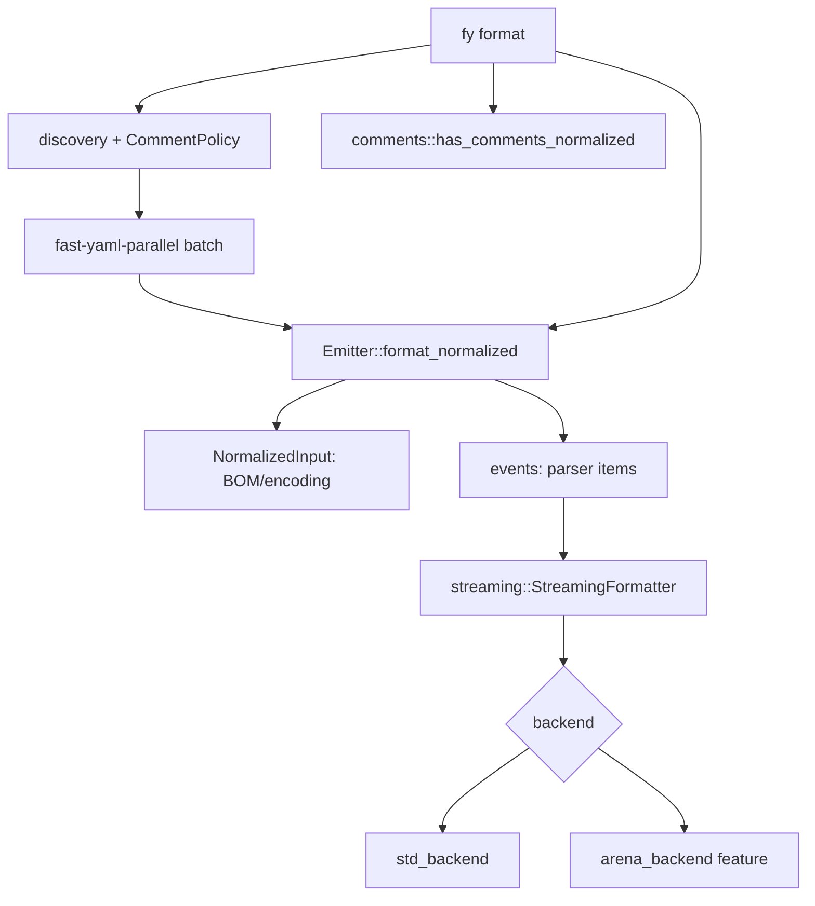

---
aliases:
  - Format Plan
tags:
  - sdd
  - plan
  - format
created: 2026-10-01
status: reverse-specified
related:
  - "[[spec]]"
  - "[[constitution]]"
---

# Technical Plan: Format

> [!info] References
> **Spec**: [[spec]]. This plan describes the implementation as it exists at 0.6.6 plus #581, #574, #580.

## 1. Architecture

### Approach
Formatting is a single pass over parser events (`events` API over `saphyr-parser`, hidden behind fast-yaml types) written straight to a text buffer. No `Value` tree is built, which is how spelling, anchors, tags, duplicate keys and directives survive. The same block writer serves two sibling pipelines: `Emitter::emit_*` (resolved `Value` to text, used by convert and the bindings' dump) and `format_*` (text to text). Comment detection is a separate scanner over the same event stream because the parser discards comments.



### Key design decisions

| Decision | Choice | Rationale | Alternatives |
|----------|--------|-----------|--------------|
| Source of formatting | Parser events, not `Value` | Preserves spelling/anchors/duplicates; no schema coercion | Load then dump (loses spelling, rejects duplicates) |
| Comments | Refuse by default, `--strip-comments` opt-in | Data-loss safety | Preserve (needs a CST; out of reach with current parser) |
| Indent | `Indent` newtype 1..=9 | Illegal values unrepresentable | `usize` + runtime check |
| Depth | Heap stack + `LimitGuard`; 256 default, 512 max | No stack overflow | Recursion |
| Multi-line scalars | Normalize to one double-quoted line | Idempotent and simple | Preserve original folding |
| Batch | `fast-yaml-parallel` with per-file isolation on the shared pool; `-j N` = N threads; scan-ahead scaled per worker with a full-limit retry lane | Throughput; one bad file never aborts the run; bounded look-ahead memory | Sequential |
| Dry-run | Exit 5 when changes pending | CI friendliness | Exit 1 (conflates with failure) |
| `width` | Typed and range-checked but unused | PyYAML-compat surface | Implement folding |

## 2. Project structure

```
crates/fast-yaml-core/src/
├── emitter/        # mod.rs (EmitterConfig, Emitter), walk.rs, flow.rs, scalar.rs
├── streaming/      # formatter.rs (StreamingFormatter), std_backend.rs, arena_backend.rs, anchors.rs, directives.rs, traits.rs
├── comments.rs     # has_comments*, find_comments, CommentScanner
├── input.rs        # NormalizedInput
├── limits.rs       # Indent, Width, MaxDepth, ParseLimits, ...
crates/fast-yaml-cli/src/commands/format.rs   # EditIntent, WriteMode, FormatStatus, error hints
crates/fast-yaml-parallel/src/files/          # batch format, CommentPolicy
```

## 3. Data model

```rust
pub struct EmitterConfig {
    pub indent: Indent, pub width: Width, pub explicit_start: bool,
    pub default_flow_style: Option<bool>, pub multiline_strings: bool,
    pub max_emit_depth: MaxDepth, pub parse_limits: ParseLimits,
}
pub enum EditIntent { Preview, InPlace, Print }   // --dry-run beats -i
```
Only `indent`, `explicit_start`, `parse_limits` affect `format_*`; the CLI never sets the other fields.

## 4. API design

| Entry | Description |
|-------|-------------|
| `Emitter::format(input)` / `format_with_config` / `format_normalized` | Format text; keeps BOM |
| `streaming::format_streaming*`, `format_streaming_arena` | Lower-level; drops BOM |
| `fy format [PATHS] [--indent N] [--strip-comments] [-i\|-n] [-j N] [-o FILE] [limits]` | CLI |

Exit codes: 0 ok, 1 failure (including comment refusal), 2 usage, 5 dry-run would change.

## 5. Integration points

| System | Direction | Notes |
|--------|-----------|-------|
| `fast-yaml-parallel` | CLI to lib | batch format, comment policy, per-file results |
| Python / Node bindings | consumers | `format`/`format_files*` wrap the same core and parallel code |
| Linter | independent | lint does not use the formatter |

## 6. Security

Input size (`MaxInputBytes`), scan-ahead (`MaxScanAhead`), depth, and alias limits are enforced in the shared parser guard before emission. In-place writes happen only after a successful format of the full input.

## 7. Testing strategy

| Level | Tooling | What |
|-------|---------|------|
| Unit | nextest, `emitter/*` tests | scalar quoting, indent, depth |
| Golden/regression | `tests/emit_golden.rs`, `streaming_format_regressions.rs` | layouts at every indent, directives, anchors |
| Property | proptest `emit_roundtrip_proptest.rs` | block emit round-trips at every indent |
| Fuzz | `fuzz/fuzz_targets/format.rs` | no panic, idempotency |
| CLI integration | `crates/fast-yaml-cli/tests` | dry-run exit codes, comment guard, in-place |
| Manual | fixtures in `tests/fixtures/` | idempotency sweep (`--strip-comments`) |

Missing tests worth adding: duplicate-key preservation, error precedence (comment vs syntax), width inertness pin.

## 8. Performance considerations

Single streaming pass; the arena backend (`arena` feature) is optional and not enabled in Python/Node builds. Claimed 5-14 percent arena gain has no asserting benchmark. [NEEDS CLARIFICATION: publish reproducible numbers or drop claims]

## 9. Rollout plan

Already shipped. Any change to default output is a breaking change before 1.0 and goes into CHANGELOG `[Unreleased]`.

## 10. Constitution compliance

| Principle | Status | Notes |
|-----------|--------|-------|
| Type safety | Compliant | `Indent`, `Width`, `MaxDepth` newtypes; `EmitError` enum |
| Limits | Compliant | all inputs bounded; output size unbounded in core emit (see spec section 9) |
| Surface parity | Partial | bindings strip comments silently |
| Safe Rust | Compliant | file reads and writes in `fast-yaml-parallel` use no `unsafe` |

## 11. Risks and mitigations

| Risk | Impact | Probability | Mitigation |
|------|--------|-------------|------------|
| Users expect `--width` to wrap | med | high | decide implement vs remove |
| Second parse for comment detection doubles cost | low | high | use `CommentScanner` in the format pass |
| Dropping a 512-deep `Value` can overflow a small stack | med | low | iterative `Drop` or document stack need |

## See Also

- [[spec]]
