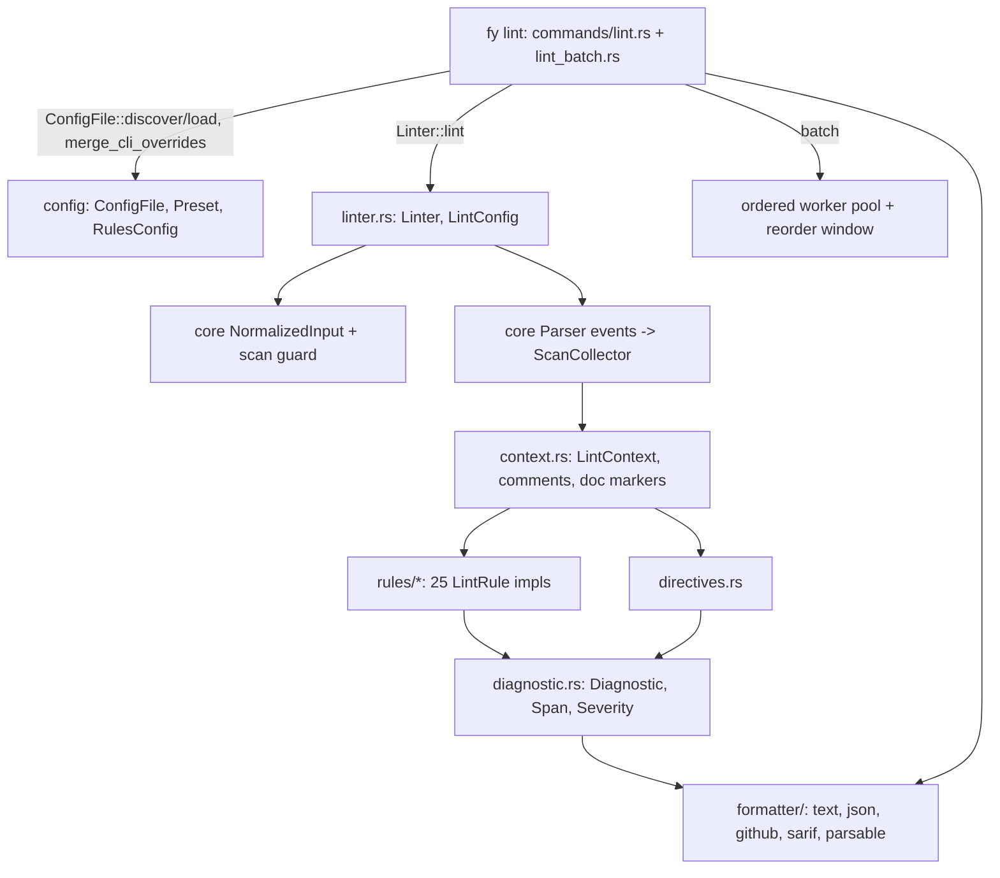

---
aliases:
  - Lint Plan
tags:
  - sdd
  - plan
  - lint
created: 2026-10-01
status: reverse-specified
related:
  - "[[spec]]"
  - "[[constitution]]"
---

# Technical Plan: Lint

> [!info] References
> **Spec**: [[spec]]. This plan describes the implementation as it exists at v0.6.6 (commit e5e6cfb) plus the fixes #571-#575, #578, #579 and #569; it is not a proposal.

## 1. Architecture

### Approach

`fast-yaml-linter` is a library crate (features `json-output`, `sarif-output`, `all-formats`) that never does file I/O; the `fy lint` command in `fast-yaml-cli` owns discovery, config loading, flag overrides, printing and exit codes. One lint run is: size check, BOM-free normalisation, one guarded loader pass whose observer collects comments, document markers, a compact node index (byte ranges, style, role, anchor/tag flags; decoded text only where it differs from the source) and flow ranges into a `SourceScan`, directive extraction, rule execution over a registry, directive filtering, sort. `ScanNeeds` is derived from the enabled rules, so keys, nodes, sets and flow ranges are collected only when some rule reads them.

Rules come in two kinds. Source rules (`SourceRule`) read the normalised source through `LintContext` and a flow/comment tokenizer and run once; document rules (`DocumentRule`) get each parsed document as a `LintDocument` with its `first_line` so locations stay file-global, and run once per document. Because configuration is a closed typed struct (`RulesConfig`, one `RuleSettings<Options>` field per built-in rule, generated by the `builtin_rules!` macro), a new built-in rule is added in exactly one macro row plus its module.

### Component diagram



### Key design decisions

| Decision | Choice | Rationale | Alternatives considered |
|----------|--------|-----------|-------------------------|
| Rule config | Closed typed `RulesConfig` via `builtin_rules!` macro; `RuleName` enum; `custom_rules` map for embedders | Illegal rule names/options unrepresentable; load-time errors name accepted options | `HashMap<String, Value>` (rejected: stringly-typed) |
| Option values | Newtypes/enums: `Limit`, `IndentSize`, `MarkerPresence`, `Forbid`, `QuoteRequirement`, `TruthySpelling`, `PatternList` | Type safety; yamllint spellings (`true`/`false`, `-1`) normalised at load | Raw ints and bools |
| Directives applied after rules | Rules run unaware of directives; `Directives::apply` filters by span start line and adds `lint-directive` warnings | Rules stay simple; suppression uniform for built-in and custom rules; `disable-file` short-circuits rule execution | Pass suppression state into each rule |
| Single guarded parse | Parse once with `validate_normalized_observed` (`parse_normalized_observed` only when a `DocumentRule` is enabled), collecting comments, doc boundaries, the node index and flow ranges in the same pass; lazy `LintContext::scan()` uses `SourceScan::of_source(.., ParseLimits)`, also guarded | Lint RSS is about 1.1x parse on the measured input (3.6x with the former extra passes); no unguarded parser is reachable from a rule, pinned by `clippy::disallowed_methods` | Per-rule re-parses (previous design) |
| Rule tokenisation | Text-scan rules use `tokenizer.rs` / `flow_common.rs` and `node_roles.rs` over ranges from the scan; no rule re-parses the source | Gives exact columns for spacing rules without a second parse | Event-only (not possible for whitespace rules) |
| Config files | One bounded regular-file reader for config, `extends` and `ignore-from-file`; `extends` is resolved recursively (depth 8, cycle check) and the extended file's errors are redacted | A FIFO, `/dev/zero` or a huge file in an untrusted checkout must not hang or exhaust CI | `std::fs::read` per file |
| yamllint compatibility | `Preset` mirrors yamllint `default`/`relaxed`; unsupported yamllint options are rejected, not ignored | No silent behaviour difference | Accept and ignore |
| Report formats outside the lint core | `formatter::ReportFormat::render(&[FileReport])` takes absolute `ReportPath`s; library does no I/O | Library stays pure; CLI canonicalises | Formatters that read files |
| Ordering | Per file sort by span start; batch collects results in index order from a worker pool through a bounded reorder window | Deterministic output with bounded memory | Collect all then sort (unbounded memory) |
| Severity mapping | Rule severity enum kept as-is in JSON/text; github maps info/hint to notice, SARIF to note, parsable to warning | Each target format has fewer levels | One mapping for all |

## 2. Project structure

```
crates/fast-yaml-linter/src/
├── lib.rs, linter.rs        # Linter, LintConfig, LintError, finish() = directives + sort
├── context.rs, scan.rs      # LintContext, ScanCollector/SourceScan/ScanNeeds (comments, markers, node index, flow ranges)
├── set_members.rs           # `!!set` member values from the scan (set-values rule)
├── tokenizer.rs, comments.rs, location.rs, source/  # spans, offsets, flow tokenisation
├── diagnostic.rs, severity.rs, echo.rs              # Diagnostic(Builder), codes, bounded echo of user text
├── directives.rs            # # fy:/# yamllint comment directives
├── config/
│   ├── rules.rs             # builtin_rules! macro, RuleName, RulesConfig, RuleSettings
│   ├── values.rs            # Limit, IndentSize, MarkerPresence, YamlFiles, IgnorePatterns
│   ├── config_file.rs       # ConfigFile load/discover/merge_cli_overrides
│   ├── preset.rs            # yamllint default + relaxed
│   └── path_patterns.rs
├── rules/                   # one module per rule + flow_common, node_roles, core_schema
└── formatter/               # text, json, github, sarif, parsable, report (ReportPath), syntax (syntax_diagnostic)
crates/fast-yaml-cli/src/commands/
├── lint.rs                  # single input: config resolution, linting, printing, exit code
└── lint_batch.rs            # ordered parallel lint of many files
crates/fast-yaml-linter/tests/  # directive, fixture, flow masking, NUL, SARIF schema, utf8 offsets, yamllint parity, golden_corpus, lint_memory
```

## 3. Data model

```rust
pub struct Diagnostic { code: DiagnosticCode, severity: Severity, message: String,
                        span: Span, context: Option<DiagnosticContext>, suggestions: Vec<Suggestion> }
pub struct LintConfig { rules: RulesConfig, custom_rules: HashMap<CustomRuleCode, RuleSettings<NoOptions>>,
                        parse_limits: ParseLimits, max_input_bytes: MaxInputBytes }
pub struct RuleSettings<O> { enabled: bool, severity: Option<Severity>, options: O }
pub trait LintRule: Send + Sync { fn id(&self) -> RuleId<'_>; fn name(&self) -> &str; fn description(&self) -> &str;
    fn default_severity(&self) -> Severity; }
pub trait SourceRule: LintRule { fn check(&self, ctx: &LintContext, cfg: &LintConfig) -> Vec<Finding>;
    fn diagnose(&self, ctx: &LintContext, cfg: &LintConfig) -> Vec<Diagnostic>; /* provided: stamps code and severity */ }
pub trait DocumentRule: LintRule {
    fn check(&self, ctx: &LintContext, doc: LintDocument<'_>, cfg: &LintConfig) -> Vec<Finding>; }
```

Config file grammar: `extends`, `rules`, `ignore`, `ignore-from-file`, `yaml-files`, `max-input-bytes`, `max-scan-ahead`, `max-diagnostics` (see spec FR-012..FR-015). Without `extends` rules start from `RulesConfig::default()` (all on); with a preset, from `Preset::rules()`; with a file path, from the extended file's resolved rules (`apply_over_preset`). `ConfigFile::load` walks the chain with a visited list (`MAX_EXTENDS_DEPTH` = 8) and reads each file through `read_bounded` (`MAX_CONFIG_FILE_BYTES` = 1 MiB).

## 4. API design

| Surface | Entry points |
|---------|--------------|
| Rust | `Linter::with_all_rules()`, `with_config(LintConfig)`, `lint(&str)`, `add_rule(Rule)`; `ConfigFile::{discover, load, into_parts, merge_cli_overrides}`; `formatter::{TextFormatter, JsonFormatter, ReportFormat::render}`, `syntax_diagnostic`, `input_error_diagnostic` |
| CLI | `fy lint [PATHS] [--config F | --no-config] [--format text|json|github|sarif|parsable] [--max-line-length N] [--indent-size N] [--allow-duplicate-keys] [--max-diagnostics N] [--stdin-files] [--include/--exclude/--no-recursive/-j] [--max-input-bytes] [--max-scan-ahead] [--max-depth] [--max-alias-bytes]` |
| Python / Node.js | `Linter`, `LintConfig`, `lint`; Python also `format_diagnostics` (text, json only); rule inputs typed in `rule_input.rs` |

## 5. Security

- Input size and scan-ahead bounded before any rule runs; NUL rejected; user text echoed in messages is truncated by `echo` (`KEY_LIMIT`, `MESSAGE_LIMIT`).
- `github` and `parsable` formats escape or flatten newlines in messages and paths so a hostile file name cannot forge a second annotation.
- Config files are read as bounded regular files (path checked before open, opened file re-checked, at most 1 MiB), parsed with the guarded core parser first (alias bombs rejected), then deserialised. Errors about an `extends` target never quote its content (`ConfigFileError::without_content` classifies every variant exhaustively).
- `fy lint -o` streams into an `AtomicFile` and refuses an output that is an input; stdout and stderr go through a sink that ignores `EPIPE`.
- Regexes from `quoted-strings` (`extra-required`, `extra-allowed`) are compiled with the `regex` crate (linear time).

## 6. Testing strategy

| Level | Framework | What |
|-------|-----------|------|
| Unit | `cargo nextest` in `fast-yaml-linter` | Each rule (bad/good, options), config parsing (`options_tests.rs`), presets, directives |
| Fixture | `tests/fixture_tests.rs` + `tests/fixtures/` | Whole-file expected diagnostics |
| Parity | `tests/yamllint_parity_tests.rs`, `yamllint_rules_parity_tests.rs` | Subset against yamllint expectations |
| Golden | `tests/golden_corpus.rs` + `tests/golden/{default,strict}.txt` | Every fixture under `tests/fixtures/**` with all rules, parsable output pinned; any new fixture changes the snapshot |
| Memory | `tests/lint_memory.rs` (`peak_alloc`) | Lint heap peak against load peak on a 1 MiB root flow, default and relaxed |
| Schema | `tests/sarif_schema.rs` (`jsonschema`) | SARIF 2.1.0 validity |
| CLI integration | `assert_cmd` in `fast-yaml-cli/tests` | Exit codes, formats, config discovery, batch order |
| Live | Real `fy lint` runs per the continuous-improvement rule | End-to-end of every change |

## 7. Performance considerations

Linear passes only; one guarded loader pass per lint, shared by every rule (`clippy.toml` bans unbounded `Parser::new_from_str`). RSS is about 1.1x `fy parse` on spaced-ints root flows; diagnostic-heavy input (a `commas` diagnostic per scalar) costs 2.4-2.6x because each diagnostic keeps a context excerpt (spec D-18). Batch lint keeps at most a window of finished results in memory. No linter benchmarks exist in-repo; memory is pinned by `tests/lint_memory.rs`.

## 8. Constitution compliance

| Principle | Status | Notes |
|-----------|--------|-------|
| Type safety | Compliant | Closed rule/option types; load-time validation |
| Limits | Compliant | `ParseLimits`, `max-input-bytes`, `max-scan-ahead` applied by `Linter` |
| Surface parity | Gap | Bindings: text/json only, no config file loading (spec D-16) |
| Deterministic output | Compliant | Sorted diagnostics, ordered batch |

## 9. Risks and mitigations

| Risk | Impact | Probability | Mitigation |
|------|--------|-------------|------------|
| Text-scan rules diverge from yamllint (spec D-9, D-19, D-21) | med | high | Move to event-based checks rule by rule; parity tests |
| Diagnostic volume inflates lint memory (spec D-18) | med | med | Cap or lazily render context per line; extend `lint_memory.rs` |
| Changing defaults breaks users' CI | high | med | Ask-first boundary; CHANGELOG as breaking change before 1.0 |
| Inconsistent exit-code contract (D-1) | high | med | Decide table once in [[006-cli-contract/spec]], add one integration test per code |
| Absolute paths in CI formats (D-5) | med | med | Offer repo-relative mode |

## See Also

- [[spec]] — feature specification
- [[constitution]] — principles
