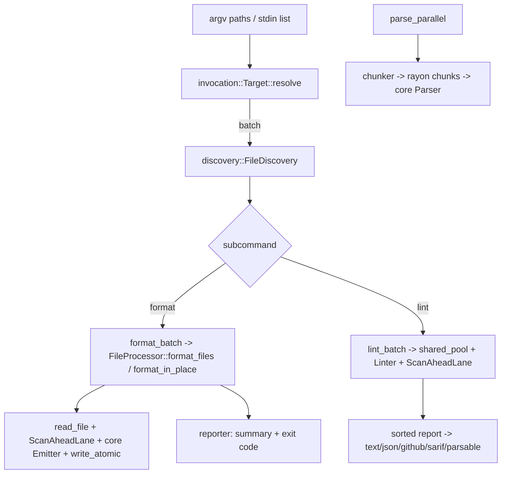

---
aliases:
  - Batch and parallel plan
tags:
  - sdd
  - plan
  - batch
  - parallel
created: 2026-10-01
status: reverse-specified
related:
  - "[[spec]]"
  - "[[constitution]]"
---

# Technical Plan: Batch and parallel processing

> [!info] References
> **Spec**: [[spec]]. This plan describes the existing implementation (v0.6.6) plus the fixes #581/#532, #531, #366, #577 and #574.

## 1. Architecture

### Approach
Two layers. `fast-yaml-parallel` is a library with no CLI knowledge: it reads files safely, runs a closure per file or per document chunk on rayon, and aggregates results. `fast-yaml-cli` owns discovery (paths to a sorted, de-duplicated file list), mode selection, config, rendering and exit codes. The CLI calls `FileProcessor` for `format`, and for `lint` runs its own ordered pipeline on the same cached `shared_pool(n)` because lint needs per-file linter state and ordered report rendering. Both honour `-j N` and share one scan-ahead policy.



### Key design decisions

| Decision | Choice | Rationale | Alternatives |
|----------|--------|-----------|--------------|
| Scheduling | rayon `par_iter` on indexed slices | Order-preserving `collect`, work stealing | Channel-based pipeline |
| Small-batch cutoff | Sequential below 4 files, or < 1 MB and < 10 files | Avoid pool overhead | Always parallel |
| Document splitting | Hand-written state machine over lines (`chunker.rs`) | Parse chunks independently; handles directives, `...`, root block scalars, quoting | Parse once and slice by events |
| Error choice | Lowest chunk index wins | Deterministic regardless of timing | First error observed |
| Reading | `read_file`: regular-file check before and after open, fstat size check, `take(max+1)`, decode; no mmap | Bounded memory, no unbounded reads, no `unsafe` | mmap (removed: SIGBUS race) |
| Writing | `write_atomic` / `AtomicFile`: O_EXCL temp in same dir, fsync, owner and mode restored, rename, dir fsync; caller-owned hard-linked target written in place via `O_NOFOLLOW` | No torn files, no planted-symlink following, links keep their content | Truncate-and-write |
| Pool | One cached `Arc<ThreadPool>` keyed by worker count (`pool.rs`) | Thread spawn is costly; `-j N` means N threads | A pool per call (previous), global pool only |
| Scan-ahead | `ScanAheadPolicy::{Fixed, Scaled}`; `Scaled` = `max(default / workers, 1 MiB)` with a per-run retry lane at the full limit | Bounds worst-case look-ahead memory (about 190 B per char per worker) while keeping every file's outcome equal to a single-file run | Per-worker fixed 4 Mi (workers x 760 MB worst case) |
| Lint report | Collect per-file results, sort by path, render once | Deterministic output for any `-j` | Stream as completed |
| Discovery | `ignore::WalkBuilder` + `globset` + `glob` | gitignore and hidden handling for free | Hand-rolled walk |
| Path trust | Caller validates (library), CLI canonicalises and de-dups | Library stays primitive | Sandbox in library |

## 2. Project structure

```
crates/fast-yaml-parallel/src/
  lib.rs            public API: parse_parallel(_with_config), re-exports
  config.rs         Config builder and defaults
  chunker.rs        document-boundary state machine, SourceOrigin for error marks
  processor.rs      document-level parallel parse, pool selection, earliest-error rule
  files/processor.rs FileProcessor, CommentPolicy, FormatOutput
  io/reader.rs      read_file (bounded regular-file read)
  pool.rs           shared_pool, per-process cached rayon pool
  scan_ahead.rs     ScanAheadPolicy, ScanAheadLane
  result.rs         FileOutcome, FileResult, BatchResult
  atomic.rs         write_atomic, AtomicFile
  error.rs          Error / Result
crates/fast-yaml-cli/src/
  discovery.rs      DiscoveryConfig, FileDiscovery, glob and --stdin-files handling
  invocation.rs     Target::resolve (stdin / file / batch)
  commands/format_batch.rs, lint_batch.rs
  reporter/         BatchResult summary, events, exit-code selection
```

## 3. Data model

`Config` defaults: `workers=None`, `max_input_bytes=100 MiB`, `sequential_threshold=4096`, `ParseLimits::default()` (document limit 100_000 inside), `scan_ahead=Fixed(default)`. Pools cap at 128 threads.

`BatchResult { total, success, changed, failed, duration, errors }`; `from_results` folds `FileResult` values and sets `duration` only for aggregation (callers overwrite it).

CLI constants: stdin list max 100,000 lines of at most 4096 bytes; glob max 100,000 matches; walk depth 100.

## 4. API design

Library: `parse_parallel(&str) -> Result<Vec<Value>>`, `parse_parallel_with_config(&str, &Config)`, `FileProcessor::{new, with_config, process, parse_files, format_files(paths, &EmitterConfig, CommentPolicy) -> Vec<(PathBuf, Result<FormatOutput>)>, format_in_place(paths, &EmitterConfig, CommentPolicy) -> BatchResult}`, `read_file(&Path, MaxInputBytes) -> Result<String>`, `shared_pool(NonZeroUsize) -> Result<Arc<ThreadPool>>`, `write_atomic(&Path, &[u8]) -> io::Result<()>`, `AtomicFile::{create, commit}`, `ScanAheadPolicy`, `ScanAheadLane::{for_policy, first_limit, run}`.

CLI contract is in [[006-cli-contract/spec|the CLI contract]].

## 5. Integration points

| System | Direction | Notes |
|--------|-----------|-------|
| `fast-yaml-core` | inbound | `Parser`, `Emitter`, `NormalizedInput`, limits (`MaxInputBytes`, `MaxScanAhead`, `ParseLimits` with `max_documents`, `StreamBudget`, `KeyDomain`), `has_comments_normalized` |
| Python / Node bindings | outbound | Use `parse_parallel`, `FileProcessor`; surface differences in their own specs |
| `rayon`, `tempfile`, `libc` (Unix, for `O_NOFOLLOW` only), `ignore`, `globset`, `glob` | inbound | Scheduling, temp files, open flag, discovery (`ignore`, `globset`, `glob` in the CLI) |

## 6. Security

- Input size enforced before and during read; document count enforced before parsing (chunker) and per document start (`StreamBudget`).
- Atomic writes with `O_EXCL` temp names; non-regular targets and dangling links refused; a hard-linked target is written in place only for its owner.
- Symlinks are not followed during walks; explicit symlinked files are followed. The library does not canonicalise or filter `..` (documented trust boundary).
- No `unsafe` and no memory map: the former mmap race no longer exists.
- Residual risks: aggregate batch memory (spec item 9, 14); xattrs/ACLs lost on rewrite.

## 7. Testing strategy

| Level | Framework | What | Notes |
|-------|-----------|------|-------|
| Unit | cargo nextest | chunker states, config, reader limits, atomic write, result folding | in-crate `#[cfg(test)]` |
| Parity | integration `tests/parse_all_parity.rs` | `parse_parallel` vs `parse_all` on a corpus | example-based |
| CLI integration | `assert_cmd` in `crates/fast-yaml-cli/tests` | exit codes, summaries, discovery errors, ordering | |
| Lane / pool | `tests/scan_ahead_lane.rs`, `tests/worker_limit.rs` | Retry lane scales and serializes; `-j N` runs N threads; `shared_pool` is one per process | pool test serialized because the slot is process-wide |
| Missing | fuzz / proptest | chunker vs sequential; `-j` determinism | see spec open question 11 |

## 8. Performance considerations

- Speedup claims in docs (3-3.5x on 4 cores, etc.) have no reproducing benchmark at HEAD; benches in `benches/parallel_benchmark.rs` do not exercise `FileProcessor` for the "lint" group.
- Memory per worker is bounded by file size plus parse budget; there is no global in-flight budget.

## 9. Rollout plan

Already shipped. Any change to `-j` semantics or exclude matching is a breaking change recorded in CHANGELOG (pre-1.0, no deprecation path needed).

## 10. Constitution compliance

| Principle | Status | Notes |
|-----------|--------|-------|
| Type safety (newtype limits) | Compliant | `MaxInputBytes`, `MaxDocuments` newtypes; `CommentPolicy` enum instead of bool |
| Limits everywhere | Compliant | Document limit lives in `ParseLimits` and applies to file APIs too; `key_domain` is the only unapplied setting (spec item 3) |
| Safe Rust | Compliant | `forbid(unsafe_code)`; mmap removed |

## 11. Risks and mitigations

| Risk | Impact | Probability | Mitigation |
|------|--------|-------------|------------|
| Chunker diverges from parser on exotic block scalars | wrong documents | low | Documented divergences, add differential fuzz |
| Memory blow-up with many large files on many cores | OOM | medium | Lower `--max-input-bytes`, `-j`; consider budget |
| Aggregate batch memory above 4 workers | OOM | low | Lower `-j` or `--max-input-bytes`; consider an in-flight byte cap |

## See Also

- [[spec]] - feature specification
- [[constitution]] - project principles
