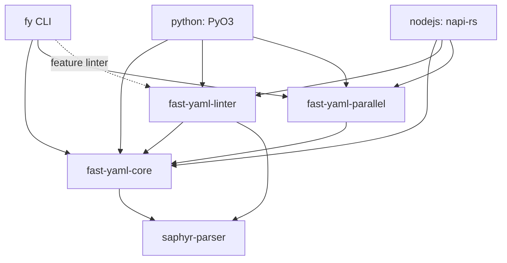

---
aliases:
  - fast-yaml Overview
  - Project Principles
tags:
  - sdd
  - constitution
  - fast-yaml
created: 2026-10-01
status: reverse-specified
---

# fast-yaml: constitution and overview

> [!abstract]
> fast-yaml is a YAML 1.2.2 toolkit with a Rust core: one parser, one resolver, one emitter and one linter, exposed through the `fy` CLI, Rust crates, a Python package and a Node.js package. This document states what the product is for, the principles every feature obeys, the architecture on one page, and the map of feature specs. Behavior described in the specs is what the code at v0.7.0 (branch release/v0.7.0, commit dbe1f2b, PRs through #637) does or is intended to do; the specs were first reverse-specified from v0.6.6 (e5e6cfb) and are kept in sync with every later PR; where the two differ, the spec says so in its "Open questions / Known deviations" section.

## 1. Purpose

Developers and CI pipelines need to validate, format, lint and convert YAML quickly and predictably, from a shell, from Rust, from Python and from Node.js, without each surface re-implementing YAML semantics.

| Audience | What they get |
|----------|---------------|
| CI / shell users | `fy parse`, `fy format`, `fy lint`, `fy convert` with stable exit codes and machine-readable output (JSON, GitHub annotations, SARIF, parsable) |
| Rust library users | `fast-yaml-core` (parse, `Value`, emit, limits), `fast-yaml-linter`, `fast-yaml-parallel` |
| Python / Node.js users | native bindings with the same parser, limits and linter, plus batch file processing |

Value proposition: correct YAML 1.2.2 semantics, bounded resource use on hostile input, and speed from a native core with parallel batch processing.

## 2. Principles (non-negotiable)

1. **Type safety first.** Illegal states are made unrepresentable: limits are validated newtypes (`MaxInputBytes`, `MaxDepth`, `MaxScanAhead`, `Indent`, `Width`, `Workers`/`WorkerCount`, ...), positions are `OneBased` and documents are `DocumentIndex`, lint config uses typed enums, rules return typed `Finding`s that the linter turns into diagnostics, diagnostics carry typed spans. No stringly-typed options inside the core. Remaining raw `usize` positions are tracked in #638.
2. **One implementation, many surfaces.** Parsing, scalar resolution, merge keys, limits and linting live in the Rust crates. Bindings and the CLI are thin adapters; they must not re-implement semantics.
3. **Surface parity.** The same input gives the same result on every surface unless a spec lists the difference as a deliberate deviation. Parity gaps are bugs, not features.
4. **Bounded by default.** Every untrusted input passes the same size, NUL/BOM, depth, scan-ahead, document-count and expansion checks, whichever surface or rule reads it; config files are bounded too. Limits have documented defaults and validated ranges. See [[009-limits-security/spec]].
5. **No silent data loss.** Operations that can drop information (comment stripping, key reordering, precision loss) must be explicit or refused, never implicit.
6. **Deterministic output.** Batch and parallel runs produce the same ordered output as a sequential run.
7. **Atomic writes.** File rewrites and `-o` outputs go through a temp file plus rename (`write_atomic`, `AtomicFile`); a failed run leaves originals intact. The one exception is a hard-linked target owned by the caller, written in place (see [[005-batch-parallel/spec]] FR-008).
8. **Safe Rust.** `unsafe_code = deny` workspace-wide; `fast-yaml-core`, `fast-yaml-linter` and `fast-yaml-parallel` set `forbid(unsafe_code)`; local `allow` only at FFI boundaries, each justified. There is no memory mapping.
9. **Quality gate.** `cargo +nightly fmt --check`, `clippy -D warnings` (pedantic and nursery), `cargo nextest`, rustdoc without broken links. Every public item is documented.
10. **Pre-1.0 policy.** Breaking changes are allowed and recorded in `CHANGELOG.md`; no deprecation shims.

## 3. Architecture on one page

| Layer | Responsibility |
|-------|----------------|
| `fast-yaml-core` | `NormalizedInput` (BOM-free text plus offset map), bounded scanner, events API (saphyr types are hidden), resolved `Value`, YAML 1.2 core-schema scalar resolution, merge keys, `ParseLimits` (depth, alias, tag, scan-ahead, documents), emitter and streaming comment-aware formatter |
| `fast-yaml-linter` | rule engine (25 rules) over one guarded loader pass, config and presets (yamllint-compatible subset, `extends`, `ignore-from-file`), inline directives, text/json/github/sarif/parsable formatters |
| `fast-yaml-parallel` | document-level parallel parse via a chunker, file-level batch processing, bounded file reads, one shared rayon pool, scan-ahead scaling with a retry lane, ordered results, atomic writes (`write_atomic`, `AtomicFile`) |
| `fast-yaml-cli` (`fy`) | argument parsing, file discovery, stdin/stdout, exit codes, output channels |
| `python/`, `nodejs/` | FFI adapters; PyYAML-style and js-yaml-style APIs on top of the same core |

Data flow of every command: bytes -> input checks (size, NUL, encoding/BOM) -> `NormalizedInput` -> bounded scanner -> events -> resolved `Value` (or lint context) -> emitter / report.

Toolchain: Rust edition 2024, MSRV 1.91, workspace version 0.7.0, license MIT OR Apache-2.0. FFI crates build separately (`maturin`, `napi`).

## 4. Spec map

| # | Spec | Capability | Plan |
|---|------|------------|------|
| 001 | [[001-parse-validate/spec\|Parse and validate]] | YAML 1.2.2 parsing, scalar typing, merge keys, errors, `fy parse` | [[001-parse-validate/plan\|plan]] |
| 002 | [[002-format/spec\|Format]] | canonical re-emission, comments, indent, in-place | [[002-format/plan\|plan]] |
| 003 | [[003-lint/spec\|Lint]] | rules catalog, config, directives, report formats | [[003-lint/plan\|plan]] |
| 004 | [[004-convert/spec\|Convert]] | JSON <-> YAML | - |
| 005 | [[005-batch-parallel/spec\|Batch and parallel]] | file discovery, parallel processing, ordering | [[005-batch-parallel/plan\|plan]] |
| 006 | [[006-cli-contract/spec\|CLI contract]] | flags, channels, exit codes across commands | - |
| 007 | [[007-python-api/spec\|Python API]] | `fast_yaml` package | - |
| 008 | [[008-nodejs-api/spec\|Node.js API]] | `fastyaml-rs` package | - |
| 009 | [[009-limits-security/spec\|Limits and security]] | resource limits, input hardening, file safety | - |

Reading order for a newcomer: 001, 009, 002, 003, 004, 005, 006, then the bindings.

## 5. Conventions used in the specs

- Requirement IDs `FR-NNN` are local to a spec; cross-references read "spec 003 FR-012".
- MUST means verified in code at v0.7.0 or required by the stated principle; SHOULD means desired but not fully met or only partly tested.
- Examples labeled "verified" were produced by running `fy` built from main; binding examples marked "from tests" were taken from the binding test suites.
- `[NEEDS CLARIFICATION]` marks a product decision the code cannot answer; each lives in the spec it affects, with a **Proposed:** resolution where one exists; a decision that spans several specs is repeated in each affected spec.
- Plans describe the existing implementation, not future work. No `tasks.md` is produced: unresolved items are product decisions, not yet implementation tasks. Once a decision is made, run `/sdd tasks` on the affected spec.

## 6. Earlier specs

The earlier inline-lint-directives and lint-ci-output-formats specs are implemented and folded into [[003-lint/spec]].
